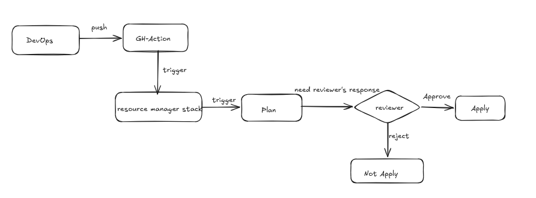
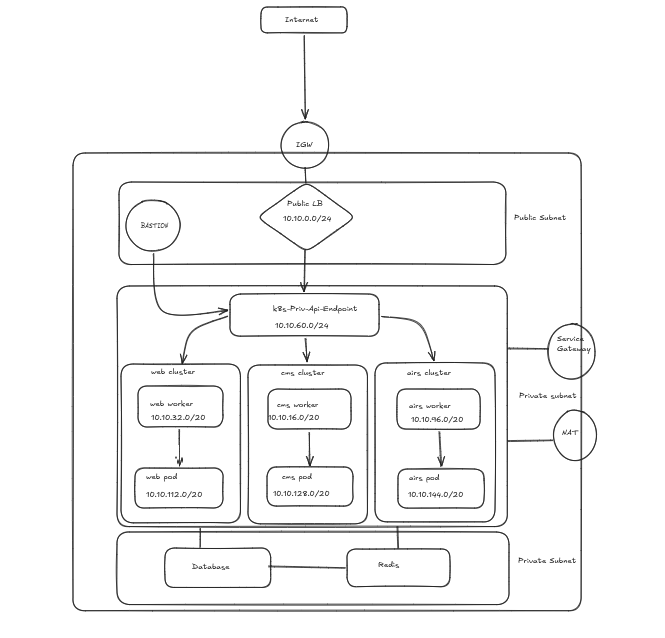

# Provision OCI Infrastucture

## Compartments

1. Prod-mgmt-comp
    - log analytics, log group, key vault, etc

2. Prod-app-comp
    - OKE, workers nodes, Instances, etc

3. Prod-data-comp
    - Database, Redis, Block Storage, etc

4. Prod-net-comp
    - Prod VCN
        - All subnets, Network Security Group, security list, route tables,etc

## VCN, Subnet and IP

VCN_NAME = **prod** 

VCN_CIDR = **10.10.0.0/16**

1. public_lb_subnet = **( 10.10.0.0/24 )**

2. cms_oke_woker_subnet = **( 10.10.16.0/20 )**

3. cms_oke_pod_subnet = **( 10.10.128.0/20 )**

4. web_oke_worker_subnet = **( 10.10.30.0/20 )**

5. web_oke_pod_subnet = **( 10.10.112.0/20 )**

6. airs_microservice_oke_worker_subnet = **( 10.10.96.0/20 )**

7. airs_microservice_pod_subnet = **( 10.10.144.0/20 )**

8. db_subnet = **( 10.10.80.0/24 )**

9. private_k8s_api_endpoint_subnet = **( 10.10.60.0/24 )**

10. private_lb_subnet = **( 10.10.55.0/24 )**

<!-- ## 🔐 NSG PROD LB

| Direction | Stateless | Source Type | Source      | Destination Type | Destination     | Protocol | Source Port Range | Destination Port Range | Allow      | Description               |
|-----------|-----------|-------------|-------------|------------------|------------------|----------|--------------------|--------------------------|------------|----------------------------|
| Ingress   | No        | CIDR        | 0.0.0.0/0   | CIDR             | All              | TCP      | All                | 443                      | TCP traffic | Allow 443 from all        |
| Ingress   | No        | CIDR        | 0.0.0.0/0   | CIDR             | All              | TCP      | All                | 80                       | TCP traffic | Allow http from all       |
| Egress    | No        | NSG         | NSG-PROD-WEB | NSG              | All              | TCP      | All                | All                      | TCP traffic | Allow LB to web           |
| Egress    | No        | NSG         | NSG-PROD-AIRS | NSG             | All              | TCP      | All                | All                      | TCP traffic | Allow LB to airs          |
| Egress    | No        | NSG         | NSG-PROD-CMS | NSG              | All              | TCP      | All                | All                      | TCP traffic | Allow LB to cms           |

## 🔐 NSG PROD CMS

| Direction | Stateless | Source Type | Source         | Destination Type | Destination     | Protocol | Source Port Range | Destination Port Range | Allow       | Description            |
|-----------|-----------|-------------|-----------------|------------------|------------------|----------|--------------------|--------------------------|-------------|-------------------------|
| Ingress   | No        | NSG         | NSG-PROD-WEB    | NSG              | All              | TCP      | All                | 9090                     | TCP traffic | Allow From NSG-PROD-WEB |
| Egress    | No        | CIDR        | 10.10.80.0/24   | CIDR             | All              | TCP      | All                | 3306                     | TCP traffic | Allow to DB subnet     |
| Ingress   | No        | NSG         | NSG-PROD-LB     | NSG              | All              | TCP      | All                | 443                      | TCP traffic | Allow From NSG-PROD-LB |
| Ingress   | No        | NSG         | NSG-PROD-LB     | NSG              | All              | TCP      | All                | 80                       | TCP traffic | Allow From NSG-PROD-LB |

## 🔐 NSG PROD WEB

| Direction | Stateless | Source Type | Source         | Destination Type | Destination     | Protocol | Source Port Range | Destination Port Range | Allow       | Description            |
|-----------|-----------|-------------|-----------------|------------------|------------------|----------|--------------------|--------------------------|-------------|-------------------------|
| Egress   | No        | NSG         | NSG-PROD-AIRS    | NSG              | All              | TCP      | All                | ALL                     | TCP traffic | Allow To NSG-PROD-AIRS |
| Egress    | No        | CIDR        | 10.10.80.0/24   | CIDR             | All              | TCP      | All                | 3306                     | TCP traffic | Allow to DB subnet     |
| Ingress   | No        | NSG         | NSG-PROD-LB     | NSG              | All              | TCP      | All                | 443                      | TCP traffic | Allow From NSG-PROD-LB |
| Ingress   | No        | NSG         | NSG-PROD-LB     | NSG              | All              | TCP      | All                | 80                       | TCP traffic | Allow From NSG-PROD-LB |

## 🔐 NSG PROD AIRS

| Direction | Stateless | Source Type | Source           | Destination Type | Destination    | Protocol      | Source Port Range | Destination Port Range | Allow        | Description          |
|-----------|-----------|-------------|-------------------|------------------|-----------------|----------------|--------------------|--------------------------|--------------|-----------------------|
| Egress    | No        | CIDR        | 10.10.80.0/24     | CIDR             | All             | All Protocols  | All                | All                      | All traffic  | Allow to db           |
| Ingress   | No        | NSG         | NSG-PROD-WEB      | NSG              | All             | TCP            | All                | 8088                     | TCP traffic  | Allow service         |
| Ingress   | No        | NSG         | NSG-PROD-API-GW   | NSG              | All             | TCP            | All                | 8080                     | TCP traffic  | Allow service         |

## 🔐 NSG PROD CAREERS

| Direction | Stateless | Source Type | Source          | Destination Type | Destination    | Protocol | Source Port Range | Destination Port Range | Allow       | Description          |
|-----------|-----------|-------------|------------------|------------------|-----------------|----------|--------------------|--------------------------|-------------|-----------------------|
| Egress    | No        | CIDR        | 10.10.80.0/24    | CIDR             | All             | TCP      | All                | 3306                     | TCP traffic | Allow egress         |
| Ingress   | No        | NSG         | NSG-PROD-BASTION | NSG              | All             | TCP      | All                | 22                       | TCP traffic | Allow http/h…        |
| Ingress   | No        | NSG         | NSG-PROD-LB      | NSG              | All             | TCP      | All                | 443                      | TCP traffic | Allow http/h…        |
| Ingress   | No        | NSG         | NSG-PROD-LB      | NSG              | All             | TCP      | All                | 80                       | TCP traffic | Allow http/h…        |

## 🔐 NSG PROD API GW

| Direction | Stateless | Source Type | Source    | Destination Type | Destination      | Protocol | Source Port Range | Destination Port Range | Allow       | Description              |
|-----------|-----------|-------------|-----------|------------------|-------------------|----------|--------------------|--------------------------|-------------|---------------------------|
| Ingress   | No        | CIDR        | 0.0.0.0/0 | CIDR             | All               | TCP      | All                | 443                      | TCP traffic | Allow https from any      |
| Egress    | No        | NSG         | NSG-PROD-AIRS | NSG           | All               | TCP      | All                | 443                      | TCP traffic | Allow to AIRS 443         |

## 🔐 NSG PROD BASTION

| Direction | Stateless | Source Type | Source    | Destination Type | Destination | Protocol | Source Port Range | Destination Port Range | Allow       | Description            |
|-----------|-----------|-------------|-----------|------------------|-------------|----------|--------------------|--------------------------|-------------|-------------------------|
| Ingress   | No        | CIDR        | 0.0.0.0/0 | CIDR             | All         | TCP      | All                | 22                       | TCP traffic | Allow https from any   |
| Egress    | No        | CIDR        | 0.0.0.0/0 | CIDR             | All         | TCP      | All                | All                      | TCP traffic | Allow to All           | -->

## Notifications

### If there's any changes on **Subnets**, **Security List**, **Network Security Group**, **Route Table**, automatically sent alerts to email. Check it out ***notification.tf***

## GitHub Action Workflow

## Requirement for GHA workflow

***In Repository Secrets,*** need to create the following secrets.

**OCI_FINGERPRINT** 

**OCI_PRIVATE_KEY**

**OCI_PRIVATE_KEY_PASSPHRASE**

**OCI_REGION**

**OCI_TENANCY_OCID**

**OCI_USER_OCID**

1. To get the above information, we can use "oci setup config" in local machine or OCI Cloud Shell.

***In Repository Variables,*** need to create the following variables.

**STACK_ID**

1. this stack_id is what you want to trigger from Github Action.

## Example of create OCI Resource Manger Configuration Source Providers and Stack

- Integrate with github for ***Configuration Source Providers***
- Create ***stack*** with specific repo with the above created ***Configuration Source Providers***

## OKE Architecture

1. Bastionhost can access every cluster
2. Bastionhost can access ssh connection to all worker nodes.
3. Use Native OCI CNI Plugin